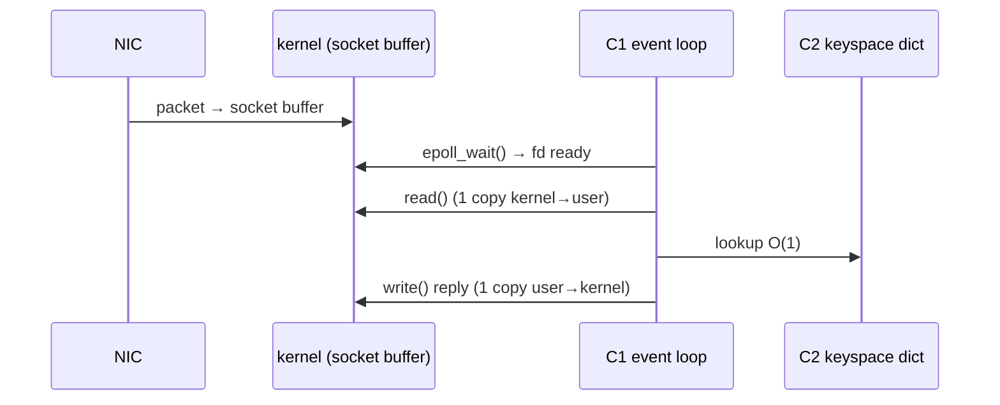

# Diagram guide — Mermaid that renders in Notion and on GitHub

Notion renders a code block whose language is `mermaid`; GitHub renders ```` ```mermaid ```` fences. Use only
`flowchart` and `sequenceDiagram` (plus `stateDiagram-v2` when the core algorithm is a state machine) — they
render everywhere.

## Which diagram where

| Section | Diagram | Shows |
|---|---|---|
| Component map | `flowchart LR` | every C-ID as a node; each edge labelled with what flows (protocol, data, signal) |
| L1–L5 | `sequenceDiagram` | the one operation crossing that layer: participants = C-IDs, kernel, NIC, disk |
| Core algorithm | `flowchart TD` or `stateDiagram-v2` | steps / states and the invariant that holds |
| Comparison | `flowchart LR` per alternative | the same operation's path through the alternative |

## Conventions

- Node text `C1["C1 event loop"]` — the ID first, so the note and the diagram link up.
- Edge labels in quotes: `C1 -->|"RESP, 1 KB"| C2`.
- Use `subgraph` for boundaries that matter: `subgraph kernel`, `subgraph node-2`.
- Keep a diagram ≤ ~15 nodes; split by layer instead of drawing everything at once.
- No HTML, no click events, no themes — plain syntax is what survives Notion.

## Example — L3 for one GET on Redis


