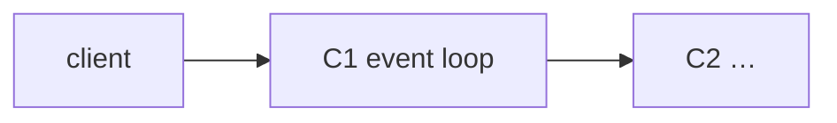
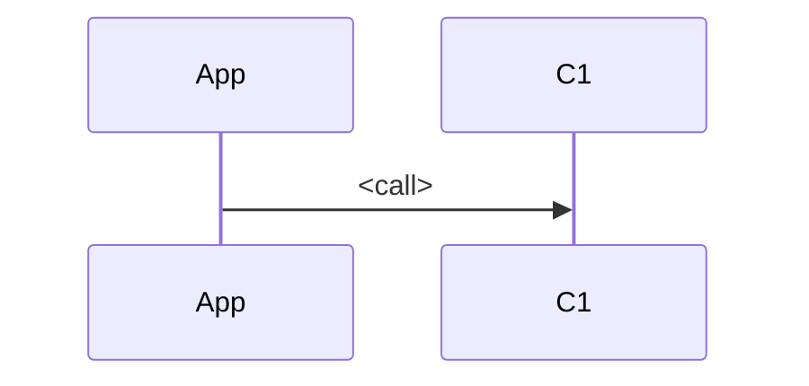

# Tree template — the note `scripts/check_tree.py` checks

Write the body in the user's language. Keep the `## ` heading **prefixes** in English exactly as below (the
checker keys on them; add words after them, e.g. `## L3 OS/kernel — epoll`). Keep the labels
`**Why it is efficient here:**` and `**Observe:**` as written.

````markdown
# <Technology> <version> — <workload in one line>

> Researched <YYYY-MM-DD> · version <x.y> · workload: <e.g. cache, 100k GET/s, 1 KB values, 1 node>

## Thesis
- Problem: <what was slow/hard before, with the mechanism that made it so>
- Core mechanism: <the one or two design choices that win this workload, naming C-IDs>
- Price: <what it gives up because of that choice>

## Component map
| ID | Component | Data structure / state | Runs on (thread/process) |
|---|---|---|---|
| C1 | <event loop> | <fd set, timers> | <main thread> |
| C2 | <…> | <…> | <…> |



## L1 Application / API
<the call the workload makes, wire format, serialization; which C-IDs it touches>

**Why it is efficient here:** <mechanism + counted cost: bytes, copies, round-trips, O(…)>
**Observe:** `<command>` → <what to look for>
Source: <URL @ version>

## L2 Runtime / engine
<data structures, algorithm, complexity, threading model, memory layout> (same 4 parts)

## L3 OS / kernel
<syscalls per operation, I/O model, page cache, copies user↔kernel, context switches, fsync> (same 4 parts)

## L4 Network
<protocol, framing, round-trips, pipelining, Nagle/keepalive/buffers> (same 4 parts)

## L5 Hardware
Not relevant: <reason> — or the same 4 parts (cache lines, sequential vs random I/O, NUMA)

## Core algorithm
<name> — steps · invariants · complexity · **breaking point** (the workload that makes it slow, and why)
Source: <paper / source file>

## Comparison
Same operation, same layers. One diagram per alternative, then the table.

```mermaid
flowchart LR
  %% <Alternative A> architecture for the same operation
```

| Layer | <Technology> | <Alternative A> | <Alternative B> |
|---|---|---|---|
| L2 | <mechanism + cost> | <mechanism + cost> | <mechanism + cost> |
| L3 | … | … | … |

Choose <Technology> when <mechanism condition>; choose <A> when <…>; choose <B> when <…>.
Sources: <URLs>

## In practice
<quick start, production settings tied to the mechanisms above (which C-ID / layer each one tunes), SDKs;
AI agent / MCP integration only when it exists>

## Sources
- <URL> — <what it backs> — <version / date>
````
